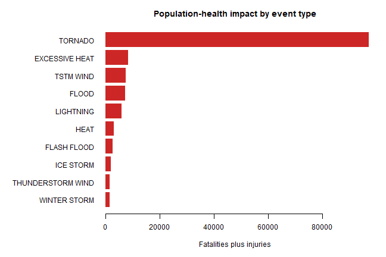
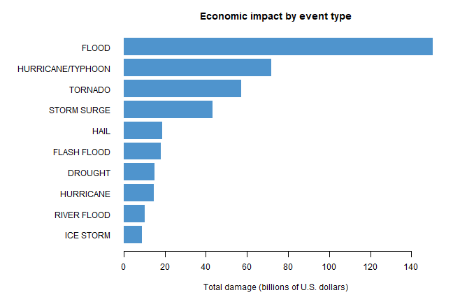

## Synopsis

This analysis uses the complete NOAA Storm Database supplied for the assignment to identify the event types associated with the greatest population-health and economic impacts across the United States. Population-health impact is measured as the sum of reported fatalities and injuries. Economic impact is measured as the sum of reported property and crop damage after converting the magnitude codes to dollar multipliers. Event labels are standardized only by trimming whitespace and converting them to uppercase, so the results remain tied to the database's `EVTYPE` categories. Tornadoes produce the largest combined number of fatalities and injuries. Floods produce the greatest total reported economic damage. The results should be interpreted with care because event naming and reporting practices vary across the historical record.

## Data Processing

The analysis begins with the raw compressed CSV file. If it is not already in the working directory, the code downloads the assignment file; `read.csv()` then reads the CSV directly through an `bzfile()` connection. Only the fields needed for the two questions are retained. Missing numerical values are replaced by zero, and event names are converted to uppercase after surrounding whitespace is removed.


``` r
knitr::opts_chunk$set(
  echo = TRUE,
  warning = FALSE,
  message = FALSE,
  fig.width = 9,
  fig.height = 6
)
options(scipen = 999)
```


``` r
data_file <- "repdata_data_StormData.csv.bz2"
data_url <- paste0(
  "https://d396qusza40orc.cloudfront.net/",
  "repdata%2Fdata%2FStormData.csv.bz2"
)

if (!file.exists(data_file)) {
  download.file(data_url, data_file, mode = "wb")
}

storm_raw <- read.csv(
  bzfile(data_file),
  stringsAsFactors = FALSE,
  check.names = FALSE
)

needed_columns <- c(
  "EVTYPE", "FATALITIES", "INJURIES",
  "PROPDMG", "PROPDMGEXP", "CROPDMG", "CROPDMGEXP"
)
storm <- storm_raw[, needed_columns]
rm(storm_raw)

storm$EVTYPE <- toupper(trimws(storm$EVTYPE))
storm$FATALITIES[is.na(storm$FATALITIES)] <- 0
storm$INJURIES[is.na(storm$INJURIES)] <- 0
storm$PROPDMG[is.na(storm$PROPDMG)] <- 0
storm$CROPDMG[is.na(storm$CROPDMG)] <- 0
```

Population-health consequences are calculated by adding fatalities and injuries for each record and then summing by event type.


``` r
storm$HEALTH_IMPACT <- storm$FATALITIES + storm$INJURIES

health_by_event <- aggregate(
  cbind(FATALITIES, INJURIES, HEALTH_IMPACT) ~ EVTYPE,
  data = storm,
  FUN = sum,
  na.rm = TRUE
)
health_by_event <- health_by_event[
  order(health_by_event$HEALTH_IMPACT, decreasing = TRUE),
]
top_health <- head(health_by_event, 10)
rownames(top_health) <- NULL
```

The damage exponent fields contain letters and, in a small number of records, digits. The following function converts `H`, `K`, `M`, and `B` to hundreds, thousands, millions, and billions. Numeric exponent codes are interpreted as powers of ten; blank or unrecognized codes contribute a multiplier of one so that their recorded base damage is not discarded.


``` r
damage_multiplier <- function(exponent) {
  code <- toupper(trimws(as.character(exponent)))
  multiplier <- rep(1, length(code))

  multiplier[code == "H"] <- 100
  multiplier[code == "K"] <- 1000
  multiplier[code == "M"] <- 1000000
  multiplier[code == "B"] <- 1000000000

  numeric_code <- grepl("^[0-9]$", code)
  multiplier[numeric_code] <- 10 ^ as.numeric(code[numeric_code])
  multiplier
}

storm$PROPERTY_DOLLARS <- storm$PROPDMG * damage_multiplier(storm$PROPDMGEXP)
storm$CROP_DOLLARS <- storm$CROPDMG * damage_multiplier(storm$CROPDMGEXP)
storm$TOTAL_DOLLARS <- storm$PROPERTY_DOLLARS + storm$CROP_DOLLARS

economic_by_event <- aggregate(
  cbind(PROPERTY_DOLLARS, CROP_DOLLARS, TOTAL_DOLLARS) ~ EVTYPE,
  data = storm,
  FUN = sum,
  na.rm = TRUE
)
economic_by_event <- economic_by_event[
  order(economic_by_event$TOTAL_DOLLARS, decreasing = TRUE),
]
top_economic <- head(economic_by_event, 10)
rownames(top_economic) <- NULL
```

## Results

### Events most harmful to population health

The ten event types with the largest combined numbers of fatalities and injuries are shown below. Tornadoes rank first by a wide margin.


``` r
knitr::kable(
  top_health,
  format.args = list(big.mark = ","),
  col.names = c("Event type", "Fatalities", "Injuries", "Total health impact"),
  caption = "Ten event types with the greatest population-health impact"
)
```


Table: Ten event types with the greatest population-health impact

|Event type        | Fatalities| Injuries| Total health impact|
|:-----------------|----------:|--------:|-------------------:|
|TORNADO           |      5,633|   91,346|              96,979|
|EXCESSIVE HEAT    |      1,903|    6,525|               8,428|
|TSTM WIND         |        504|    6,957|               7,461|
|FLOOD             |        470|    6,789|               7,259|
|LIGHTNING         |        816|    5,230|               6,046|
|HEAT              |        937|    2,100|               3,037|
|FLASH FLOOD       |        978|    1,777|               2,755|
|ICE STORM         |         89|    1,975|               2,064|
|THUNDERSTORM WIND |        133|    1,488|               1,621|
|WINTER STORM      |        206|    1,321|               1,527|


``` r
health_plot <- top_health[order(top_health$HEALTH_IMPACT), ]
par(mar = c(5, 12, 3, 2))
barplot(
  health_plot$HEALTH_IMPACT,
  names.arg = health_plot$EVTYPE,
  horiz = TRUE,
  las = 1,
  col = "firebrick3",
  border = NA,
  xlab = "Fatalities plus injuries",
  main = "Population-health impact by event type"
)
```



### Events with the greatest economic consequences

The following table reports property damage, crop damage, and their combined total in billions of dollars for the ten highest-impact event types. Floods have the largest total economic impact in this database, followed by hurricanes/typhoons and tornadoes.


``` r
economic_table <- top_economic
economic_table[, c("PROPERTY_DOLLARS", "CROP_DOLLARS", "TOTAL_DOLLARS")] <-
  economic_table[, c("PROPERTY_DOLLARS", "CROP_DOLLARS", "TOTAL_DOLLARS")] / 1000000000

knitr::kable(
  economic_table,
  digits = 2,
  format.args = list(big.mark = ","),
  col.names = c(
    "Event type", "Property damage ($ billions)",
    "Crop damage ($ billions)", "Total damage ($ billions)"
  ),
  caption = "Ten event types with the greatest reported economic impact"
)
```


Table: Ten event types with the greatest reported economic impact

|Event type        | Property damage ($ billions)| Crop damage ($ billions)| Total damage ($ billions)|
|:-----------------|----------------------------:|------------------------:|-------------------------:|
|FLOOD             |                       144.66|                     5.66|                    150.32|
|HURRICANE/TYPHOON |                        69.31|                     2.61|                     71.91|
|TORNADO           |                        56.95|                     0.41|                     57.36|
|STORM SURGE       |                        43.32|                     0.00|                     43.32|
|HAIL              |                        15.74|                     3.03|                     18.76|
|FLASH FLOOD       |                        16.82|                     1.42|                     18.24|
|DROUGHT           |                         1.05|                    13.97|                     15.02|
|HURRICANE         |                        11.87|                     2.74|                     14.61|
|RIVER FLOOD       |                         5.12|                     5.03|                     10.15|
|ICE STORM         |                         3.94|                     5.02|                      8.97|


``` r
economic_plot <- top_economic[order(top_economic$TOTAL_DOLLARS), ]
par(mar = c(5, 12, 3, 2))
barplot(
  economic_plot$TOTAL_DOLLARS / 1000000000,
  names.arg = economic_plot$EVTYPE,
  horiz = TRUE,
  las = 1,
  col = "steelblue3",
  border = NA,
  xlab = "Total damage (billions of U.S. dollars)",
  main = "Economic impact by event type"
)
```



The ranking uses reported nominal damage values and does not adjust for inflation. It also preserves the event categories found in `EVTYPE`, apart from capitalization and whitespace, so synonymous or historically inconsistent labels are not combined.
